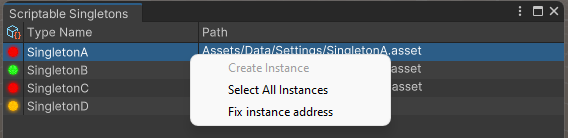

# Scriptable Singletons

## What is

Scriptable singletons is a project that uses the Unity Addressables System to handle singleton scriptable objects.

## Editor View

This project contains a useful editor window. Here you can see all issues on singletons.

As you can see, there are 3 columns, one for the singleton status, one for the singleton type name and one for the instance path in the project.

In the status column, you can see 3 different cases:

- The red icon means the singleton instance isn't in it's respective addressable path or the singleton has more than one instance in the project.
- The yellow icon means the singleton doesn't have any instance in the project.
- The green icon means the singleton has no problems.

By clicking with the right button in any singleton view, you can see automatic solution for issues or utils functions.

- Create Instance: This option will be enabled if you do not have any singleton instance. It creates the singleton instance in the given path.
- Select All Instance: This option selects all singleton instances in the editor.
- Fix Instance Address: This option will be enabled when the instance address is not correct. It sets the singleton address correctly.
